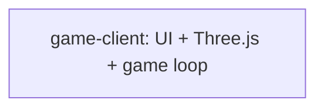

# Unit Dependency Graph

```mermaid
flowchart LR
  game-client[game-client: UI + Three.js + game loop]
```

`game-client` has no upstream project unit. It has runtime dependencies on the pinned Three.js CDN module and optional Google Fonts CSS. [runtime-graph.json]
